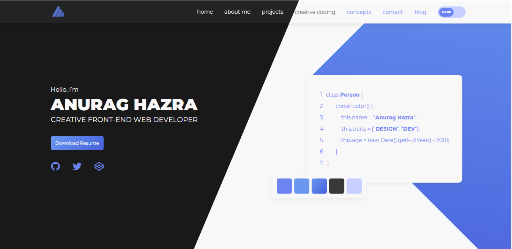

  <a href="https://rishab-sharma.github.io/">
    
    <h2 align="center">Rishab Sharma</h2>
  </a>

 

Creative FrontEnd Web Developer

<!--  -->

Strained eyes? There's DarkMode too :p

*NOTE: If you are using this site as a template for your own portfolio site, I would be very glad if you add a link to the original site with my name in footer*

Made with :heart: and Gatsbyjs
